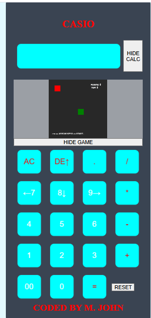

# 🐍 Snake Game Calculator

## 👋 About Me
Hello, I’m **M. JOHN**, a **Web Developer** passionate about learning and building with JavaScript.

## 📌 Project Overview
This project is a **Calculator with a built-in Snake Game**.  
It allows users to:
- ➕ Perform normal calculator operations
- 🎮 Play the classic Snake game whenever they get bored

The idea was to **combine productivity and fun in one project**.

## 📚 Learning Process
I learned how to build:
- The **Calculator**
- The **Snake Game**

through **YouTube tutorials**, then challenged myself by **merging both into one working project**.

## 🚀 Future Improvements
- More game features
- Better UI/UX
- Performance improvements
- Additional calculator functions  

This project will **continue to be upgraded**.

## 📂 More Projects
I’ll be creating and uploading more projects on my GitHub:

**GitHub:** `youngcoderplus`

Feel free to check it out for more upcoming projects.

*The initial screen showing the game buttons
---

### 📝 Written on
**June 9, 2025**

